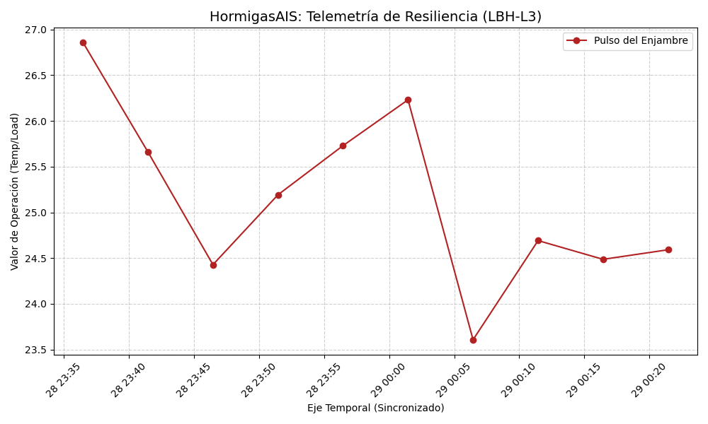

# 🐜 HormigasAIS - XOXO-LBH Adapter

### 🛰️ Telemetría en Tiempo Real (Nivel 3)

## 📡 Interfaz de Visualización y Auditoría Inalterable
Este nodo actúa como el puente de telemetría para la colonia, traduciendo eventos del **Nodo XOXO-** bajo el protocolo **LBH (Lenguaje Binary HormigasAIS)**.

## 📊 Estado de la Interfaz
* **Estado:** 🔵 Sincronizado con Nodo Núcleo (Nivel 3)
* **Visualizador:** Live Dashboard Activo
* **Gobernanza:** [lbh.human](https://github.com/Thrumanshow/xoxo-lbh-adapter/blob/dbc862e1eb4df7ac1aa0462f235e13c3a5f368d4/contracts/config/lbh.human) (Cristhiam Leonardo Hernández Quiñonez)
* **Protocolo de Agentes:** Contrato-Agents

## 🛡️ Seguridad de Datos
Toda la telemetría presentada aquí ha sido validada por la **Centinela Alpha**. Los datos son firmados mediante HMAC-2025 para asegurar que la soberanía del Fundador no sea alterada durante la transmisión.

---
*Visualizando la resiliencia desde San Miguel, El Salvador | 2025*
